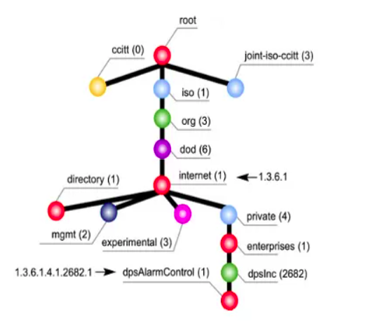

# SNMP 

- Simple network management protocol 

## HOW SNMP WORKS 

- Snmp runs demon process in agent : snmpd
- Snmp Multiplexing protocol ( SMUX ) used for communication between SNMP agent and peer processes
- SMUX is responsible to send traps to SNMP agent

## SNMP AGENT

- Snmp agent is demon running on background to collect data about network interfaces, cpu, memory

- Port 161 = used for communication of manager and agent
- Port 162 = used for agent to send trap and manager to listen trap

## SNMP MIB

- Management Information Base 
- DB ( Usally of 10KB in size )
- Stores instantaneous copy of curr state of system
- MIB extensions = .mib and .txt 
- These are just schemas and definations which describes what to monitor
- Actual values are taken form /proc dir
- Mib files location
```bash
cd /usr/share/snmp/mibs/
```
- Rules are written in SMI ( structure of management information )

**Why to use snmp if we have ssh**

- UDP 
    - Less overhead & stateless
- Traps 
    - Faster & lighter in comparision to cronjobs 
- Device support
    - SSH Only works on devices that supports shell env
    - SNMP is industry standard and it's avilable in all devices
    

## SNMP COMMUNITY

### 1. SNMP MIB View

- **MIB (Management Information Base):**  
  A database containing information (or “objects”) about a network device.

- **MIB View:**  
  A selected group of MIB objects relevant to a specific network element (e.g., router, switch).  
  *Note:* The objects in the view do not need to be from one continuous branch of the MIB tree.


### 2. SNMP Access Modes

- **READ-ONLY:**  
  Allows viewing (reading) of the data only.

- **READ-WRITE:**  
  Allows both viewing (reading) and modifying (writing) the data.


### 3. SNMP Community Profile

- **Definition:**  
  A combination of:
  - An **access mode** (READ-ONLY or READ-WRITE).
  - A **MIB view** (the subset of MIB objects being accessed).

- **How It Works:**  
  For each variable in the MIB view:
  - If marked **“none”**: The variable cannot be used.
  - If marked **“read-write”** or **“write-only”** and the profile is READ-WRITE:  
    The variable can be used for reading (get), writing (set), and sending notifications (traps).
  - Otherwise:  
    The variable can be used for reading (get) and sending traps only.
  - **Special Note:**  
    Reading a **“write-only”** variable may yield device-specific results.


### 4. SNMP Access Policies

- **Definition:**  
  An SNMP access policy links:
  - A **SNMP community** (a group or set of users) with
  - A **SNMP community profile** (the combined access mode and MIB view).

- **Purpose:**  
  The policy defines which parts of the network device’s data the community can access and the permitted operations.


## OID


An Object Identifier (OID) uniquely identifies MIB objects in SNMP using a hierarchical, dot-separated numerical tree. Each OID represents a path in this tree, ensuring global uniqueness and systematic organization.

## Types of OIDs

### 1. Scalar Object OIDs
- **Definition:**  
  Represents a single, unique instance of an object on a device.
- **Identification:**  
  Always ends with `.0`.
- **Example:**  
  - Base OID for `sysDescr`: `1.3.6.1.2.1.1.1`  
  - Instance OID for `sysDescr`: `1.3.6.1.2.1.1.1.0`

---

### 2. Tabular Object OIDs
- **Definition:**  
  Represents objects that are part of a table (or vector) in the MIB. Each row in the table is a vector of related objects.
- **Identification:**  
  The base OID defines a column, and an instance index (e.g., `.1`, `.2`, `.3`, etc.) is appended to denote a specific row.
- **Example:**  
  - Base OID for `ifDescr`: `1.3.6.1.2.1.2.2.1.2`  
  - Instance for the first row: `1.3.6.1.2.1.2.2.1.2.1`  
  - Instance for the second row: `1.3.6.1.2.1.2.2.1.2.2`



### NOTE : 
- Sometime insted of full OID, some part of OID is replaced by simplified name ( MIB name )
- Converting OID with MIB name to numeric OID is called **OID resolution** or **MIB name translation** 
