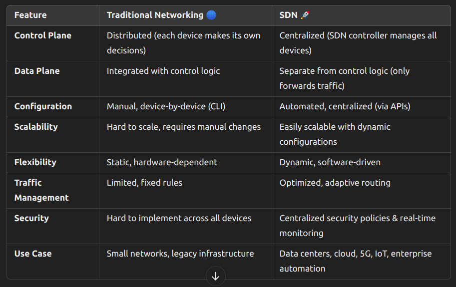

# Question - 1

**What is memory map**

Memory mapping is the process of associating virtual addresses (used by programs) with physical addresses (actual locations in RAM or other memory). This is managed by the Memory Management Unit (MMU) in modern systems.

# Question - 2

**SDN and SDN-WAN**



# Question - 3

Bluetooth

```bash
bluetoothctl show
```

**Why is Bluetooth Not Displayed in ifconfig?**
- ifconfig only shows network interfaces (Ethernet, Wi-Fi, VPN), but Bluetooth is not a network interface in the traditional sense.

- Bluetooth uses a different protocol stack (L2CAP, RFCOMM), not IP-based networking.
- It is not an IP-based device like Wi-Fi or Ethernet, so it doesn’t appear in ifconfig.
- Instead, Bluetooth is managed using hciconfig or bluetoothctl.

# Question - 4

**Manual for syscall**

```bash
man 2 [syscall_name]
```

# Question - 5

**What is tcp socket**

- Endpoint for bidirectional communication between two application
- Represents specific port on specific ip

# Question - 6

**RARP**

- Reversed address resoulution protocol 
- Used to assign ip addr to devices who has MAC addresses
- Replaced by DHCP 
    - Because RARP can't config subnetmask, default gateway etc.

# Question - 7

**prefix len** : The prefix length defines how much of the IP address is used to identify the network portion of the address, as opposed to the host portion.

**scope id** : The scope ID tells the system which network interface or link the address is associated with, especially when there are multiple interfaces on the machine.

- Scope ID is usually written as a percentage sign (%) followed by the interface name or identifier. For example, **fe80::abcd:1234:5678:abcd%eth0** means that the **link-local address = fe80::abcd:1234:5678:abcd** is associated with the eth0 interface.

- For ipv6 we have to mention interface scope for particular ipv6 so that it can recognize that this address is for link local

# Question - 8

**0.0.0.0**

- **Default Route:** In routing, 0.0.0.0 is used to refer to the "default route," meaning that any destination address that doesn't match an existing route should be forwarded to this address.

- **Binding to All Interfaces:** In some cases, when a server application (like a web server) binds to 0.0.0.0, it means that it is listening for incoming connections on all network interfaces (instead of a specific IP address).

- **Doesn't have IP:** In DCHP Discover src:0.0.0.0 indicates particular device doesn't have ip

# Question - 9

Binding refers to associating a socket (a communication endpoint) with a specific IP address and port on our system.

# Question - 10

- Session layer protocols 
    - Session initiation protocol
    - Apple talk session protocol
    - Session control protocol
    - Password Authentication protocol
    - RPC 
        - What is RPC
            - When program is allowed to execute function on remote server

# Question - 11

PDU : protocol data unit
- Message between SNMP agent and SMUX peer

